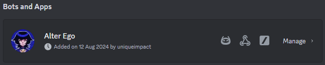
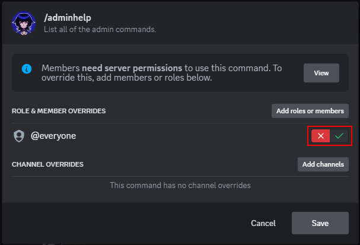
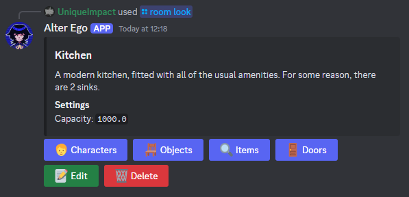
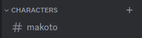
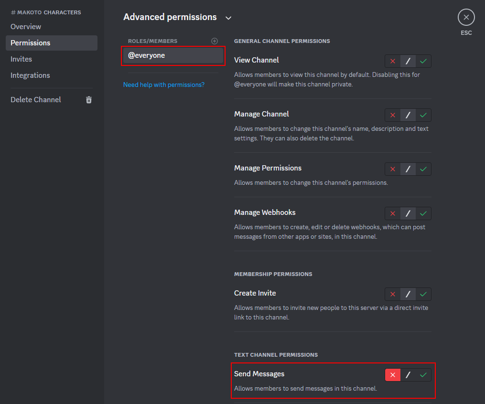
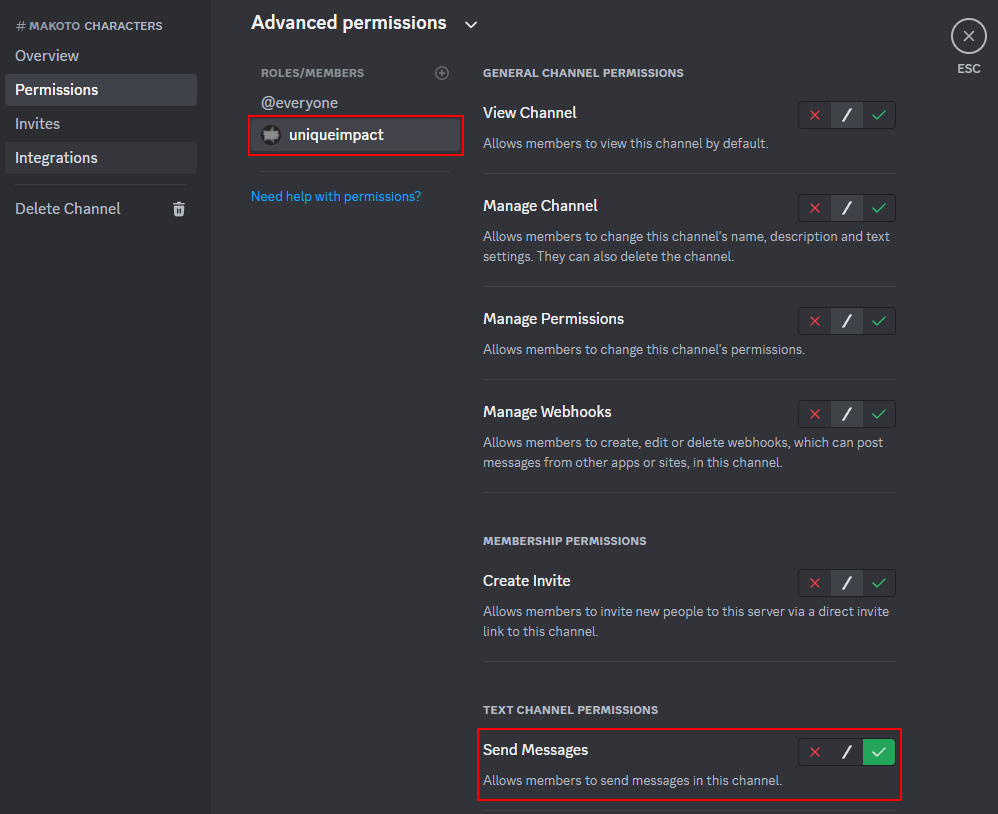
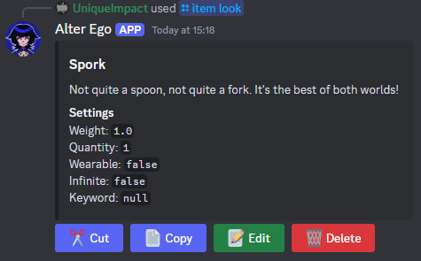
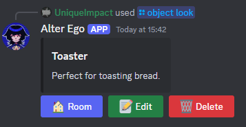
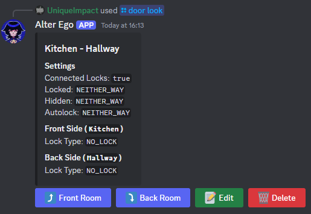

# Setup Guide

This is a basic setup guide to get you started with setting up your own roleplay using Alter Ego.

## Invite to Server

To invite Alter Ego to your Discord server, [click here](https://discord.com/oauth2/authorize?client_id=870388601861591090).

## Setting up Permissions

Before you begin setting up your roleplay, there are some recommended server permissions you should be
aware of.

If you go into your **Server Settings**, then under **Apps**, you should see the **Integrations** tab.
Open this tab, and you should see Alter Ego listed under Bots and Apps.

Press **Manage** to open Alter Ego's management page. Here, you can choose which roles and members have
access to the bot, which channels the bot can be used in, and even control which specific commands can
be used by which users.

Although the bot will only allow users with Administrator permission to use admin commands anyway, it is
still highly recommended that you restrict your players from accessing admin commands. This is because
restricting the admin commands here will remove them from your players' command lists, therefore making it
clearer to them which commands they are allowed to use.

The full list of admin commands you should restrict is:

* `/adminhelp`
* `/character`
* `/door`
* `/item`
* `/object`
* `/room`

To restrict a command, first press the command from the **Commands** list, then press **Add roles or
members**. Then, select any roles or members you would like to restrict the command from, such as
`@everyone`. Then, press **Add**, and finally, toggle the switch to the "deny" position. It should look
like the image below if done correctly. Finally, press **Save** to save your changes.

## Creating Rooms

Rooms represent the environments that characters will exist in. Each room acts as a distinct place in your
setting which characters can enter, explore, and interact with each other in. Each room also acts as a
separate chat room, meaning characters in the same room will be able to directly communicate with each
other, while characters in different rooms cannot.

To set up a room, simply use the `/room create` command. This command has the following parameters:

| Parameter   | Type     | Description                                                                                                                                                                                                                                  |
|-------------|----------|----------------------------------------------------------------------------------------------------------------------------------------------------------------------------------------------------------------------------------------------|
| name        | required | The name of the room. This will be how you reference the room in commands. Every room must have a unique name between 1 and 32 characters long.                                                                                              |
| description | required | The description of the room. You can use this field to describe the general layout of the room, including any key objects or features of the room which would be noticeable to characters. Must be between 1 and 1500 characters.            |
| capacity    | optional | The capacity of the room. This is the maximum weight of all of the items that can fit into the room. If a room is full, characters will not be able to drop items there. Must be a number between 0 and 1,000,000. Defaults to 0 if not set. |

Once you have created a room, you will be able to check that it's set up correctly with the `/room look`
command. This will show you all the details of the room, and give you options to edit and delete the
room if you need to change anything:

## Creating Characters

The way that Alter Ego manages characters is through text channels. Every character in your roleplay must
be assigned to a different text channel, and **anyone who can post messages in that channel will be able
to roleplay as that character**. Therefore, the first step to setting up a character is to create the
channel, and manage its permissions.

Let's say we want to make a character called Makoto. To do this, we first need to create a text channel.
In this case, let's create a channel called `#makoto`:

Next, we want to control who can roleplay as Makoto. To do this, let's open the channel's settings, and
go to the **Permissions** tab. If we don't want everyone to be able to roleplay as Makoto, then we should
disable the **Send Messages** permission for `@everyone` in this channel:

We could also remove the **View Channel** permission, if we wanted to control who can spectate this
character.

Next, we need to give access to any users or roles we want to be able to play as the character. We can do
this by selecting them from the **Roles/Members** list, and finding the user or role we want to be able to
play as that character. Then, we can give that user or role the **Send Messages** permission:

Now that we've configured the channel, we can create a character using the `/character create` command.
This command has the following parameters:

| Parameter        | Type     | Description                                                                                                                                                                                                                                                                                                                                                                                             |
|------------------|----------|---------------------------------------------------------------------------------------------------------------------------------------------------------------------------------------------------------------------------------------------------------------------------------------------------------------------------------------------------------------------------------------------------------|
| name             | required | The name of the character. This will be how you reference the character in commands. Every character must have a unique name between 1 and 32 characters long.                                                                                                                                                                                                                                          |
| channel          | required | The channel linked to this character. Anyone with the permission to send messages in this channel will be able to roleplay as this character. Every character must be linked to a unique text channel in your server.                                                                                                                                                                                   |
| description      | required | The description of the character. You can use this field to describe the appearance of the character, including any key features of the character which would be noticeable to characters. Must be between 1 and 1500 characters.                                                                                                                                                                       |
| room             | required | The name of the room the character is in. Every character must be placed into a room.                                                                                                                                                                                                                                                                                                                   |
| display_name     | optional | The display name of the character. If set, this will override the character's name in all places where their name is displayed, including as the username when sending messages as the character. This is useful if you want to display a more complex name for a character (e.g. first and last name) while keeping the character's name used in commands simple. Must be between 1 and 32 characters. |
| picture          | optional | The image URL of the character. This will be used as the user icon when sending messages as the character.                                                                                                                                                                                                                                                                                              |
| items_capacity   | optional | The capacity of the character's inventory. This is the maximum weight of all of the items that the character can carry. If the inventory is full, the character cannot hold any more items. Must be a number between 0 and 1,000,000. Defaults to 0 if not set.                                                                                                                                         |
| clothes_capacity | optional | The capacity of the character's clothes. This is the maximum weight of all of the items that the character can wear. If the inventory is full, the character cannot wear any more items. Must be a number between 0 and 1,000,000. Defaults to 0 if not set.                                                                                                                                            |
| hidden           | optional | Whether the character is hidden. A hidden character cannot be seen by other characters. Defaults to false if not set.                                                                                                                                                                                                                                                                                   |
| frozen           | optional | Whether the character is frozen. A frozen character cannot move to different rooms. Defaults to false if not set.                                                                                                                                                                                                                                                                                       |
| npc              | optional | Whether the character is an NPC. An NPC character is immune from freeze-all and move-all functions. This is useful for admin-controlled characters who you do not want to be affected by these functions. Defaults to false if not set.                                                                                                                                                                 |

Once you have created a character, you will be able to check that it's set up correctly with the `/character look`
command. This will show you all the details of the character, and give you options to edit and delete the
character if you need to change anything:

## Creating Items

Items represent things which characters can find, take, hold and sometimes wear. They can be used to enrich your
setting, and increase the immersion and interactiveness or your roleplay.

Before you create an item, you will need to select which inventory you would like to create the item in.
There are four types of inventory you can select. These are:

* **Room Items** - The items currently in a room. You can select a room's inventory with `/room items`.
* **Character Items** - The items a character is holding. You can select a character's inventory with `/character items`.
* **Character Clothes** - The clothes a character is wearing. You can select a character's clothes inventory with `/character clothes`.
* **Storage** - An extra inventory, not linked to any character or room. This is useful for storing items you currently don't want to put anywhere. You can select your roleplay's storage inventory with `/item storage`.

Once you have selected an inventory, that inventory will remain selected until you select a different inventory. This
means you can keep creating multiple items in the same inventory without needing to reselect it.

After you have selected an inventory, you can create an item using the `/item create` command. This command has the
following parameters:

| Parameter   | Type     | Description                                                                                                                                                                                            |
|-------------|----------|--------------------------------------------------------------------------------------------------------------------------------------------------------------------------------------------------------|
| name        | required | The name of the item. This will be how you reference the item in commands. Must be between between 1 and 32 characters long.                                                                           |
| description | required | The description of the item. You can use this field to describe the appearance of the item, including any key features which would be noticeable to characters. Must be between 1 and 1500 characters. |
| weight      | optional | The weight of the item. This is the amount of inventory space which this item uses. Must be a number between 0 and 1,000,000. Defaults to 1 if not set.                                                |
| quantity    | optional | The quantity of the item. This is how many of this item there are in this inventory. Must be a number between 0 and 1,000,000. Defaults to 1 if not set.                                               |
| wearable    | optional | Whether the item is wearable. If an item is wearable, then characters will be able to wear them. Defaults to false if not set.                                                                         |
| infinite    | optional | Whether the item can be taken infinitely. This is useful to set up items which you want characters to be able to take as many times as they want. Defaults to false if not set.                        |
| keyword     | optional | If set, then characters holding this item will be able to lock and unlock doors which are set to a key lock, and have the same keyword.                                                                |

Once you have created an item, you will be able to check that it's set up correctly with the `/item look`
command. This will show you all the details of the item, and give you options to edit and delete the
item if you need to change anything. Note that this will only show you items in the currently selected
inventory, so if you want to look at items in a different inventory, you will need to select that
inventory first:

## Creating Objects

Objects are features in rooms which can be examined, but not taken. They are useful for things like large
furniture items, objects which are attached or stuck in place, or evidence or examinable spots during
investigations which you don't want characters to take.

To create an object, simply use the `/object create` command. This command has the following parameters:

| Parameter   | Type     | Description                                                                                                                                                                                                |
|-------------|----------|------------------------------------------------------------------------------------------------------------------------------------------------------------------------------------------------------------|
| room        | required | The name of the room the object is in. Every object must be placed into a room.                                                                                                                            |
| name        | required | The name of the object. This will be how you reference the object in commands. Must be between 1 and 32 characters long.                                                                                   |
| description | required | The description of the object. You can use this field to describe the appearance of the object, including any key features which would be noticeable to characters. Must be between 1 and 1500 characters. |

Once you have created an object, you will be able to check that it's set up correctly with the `/object look`
command. This will show you all the details of the object, and give you options to edit and delete the
object if you need to change anything:

## Creating Doors

Doors represent the connections between rooms. In order for characters to be able to navigate around your
setting to different rooms, setting up doors is essential. Doors can be configured with various different
settings, giving you a lot of control over how they work, including how they can be locked and unlocked by
characters.

To create a door, simply use the `/door create` command. This command has the following parameters:

| Parameter  | Type     | Description                                                                                                                                               |
|------------|----------|-----------------------------------------------------------------------------------------------------------------------------------------------------------|
| front_room | required | The name of the room on the front side of the door. Cannot be the same as the back_room.                                                                  |
| back_room  | required | The name of the room on the back side of the door. Cannot be the same as the front_room.                                                                  |
| lock_type  | optional | The type of lock on the door. There are various lock types, which have different requirements for characters to be able to use them. Defaults to no lock. |
| keyword    | optional | The keyword associated with this door. Depending on the lock_type, this will affect the requirements for unlocking the door.                              |
| hidden     | optional | Whether the door is hidden. Hidden doors cannot be seen or passed through by characters. Defaults to false.                                               |
| locked     | optional | Whether the door is locked. Locked doors cannot be passed through by characters. Defaults to false.                                                       |
| autolock   | optional | Whether the door automatically locks when a character passes through it. Defaults to false.                                                               |

Once you have created a door, you will be able to check that it's set up correctly with the `/door look`
command. This will show you all the details of the door, and give you options to edit and delete the
door if you need to change anything:

Note that doors have a number of customisation options which are not accessible in the `/door create` command,
such as being able to set different lock types and keywords for each side of the door, setting whether the locks
on each side of the door are connected, and being able to make the hidden, locked and autolock fields directional.
These features are available by editing the door after it is created.

## Further Help

If you need further help with setting up the bot, please feel free to join the support server by [clicking here](https://discord.gg/uRVhZAhZzV).